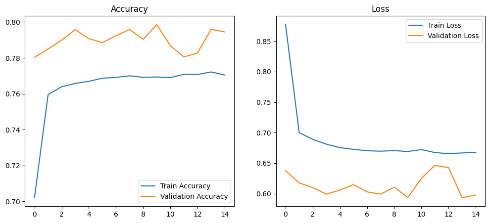
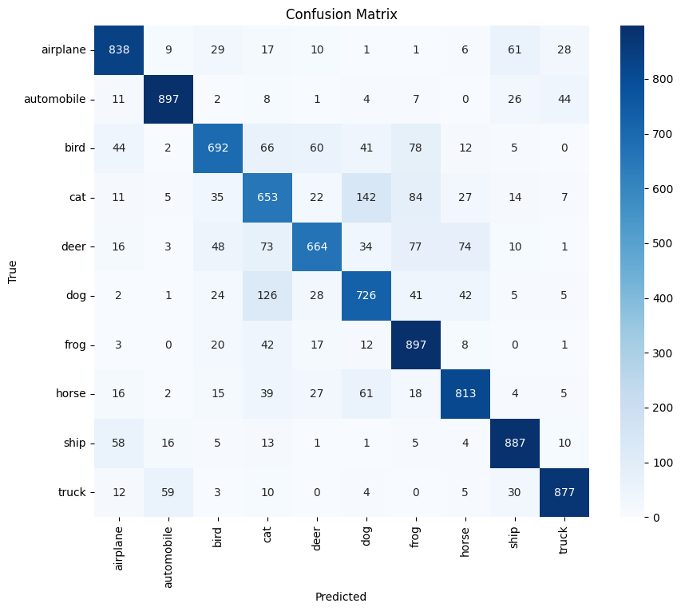

Project Overview

This project implements an image classification model using the MobileNetV2 architecture on the CIFAR-10 dataset. The goal is to accurately classify images into one of the 10 predefined categories, such as airplanes, ships, cats, and automobiles.

About MobileNetV2

MobileNetV2 is a lightweight and efficient convolutional neural network architecture developed by Google for mobile and embedded vision applications. It builds upon the original MobileNet by introducing two key innovations: 
Inverted Residuals with Linear Bottlenecks: Instead of expanding the number of channels after convolution (as in traditional residual blocks), MobileNetV2 first expands the input channels, applies depthwise convolutions, and then projects them back to a lower-dimensional output using linear bottlenecks. This helps preserve features while reducing computation.
Depthwise Separable Convolutions: These convolutions factorize a standard convolution into a depthwise convolution (which filters input channels separately) and a pointwise convolution (which combines them). This drastically reduces the number of parameters and computation without sacrificing much accuracy

About CIFAR-10 Dataset

The CIFAR-10 dataset is a widely used benchmark in computer vision, especially for image classification tasks. It was created by the Canadian Institute For Advanced Research (CIFAR) and consists of:
60,000 color images, each of size 32×32 pixels
10 classes, with 6,000 images per class


```
              precision    recall  f1-score   support

airplane         0.83      0.84      0.83      1000
automobile       0.90      0.90      0.90      1000
bird             0.79      0.69      0.74      1000
cat              0.62      0.65      0.64      1000
deer             0.80      0.66      0.73      1000
dog              0.71      0.73      0.72      1000
frog             0.74      0.90      0.81      1000
horse            0.82      0.81      0.82      1000
ship             0.85      0.89      0.87      1000
truck            0.90      0.88      0.89      1000

accuracy                             0.79     10000
macro avg        0.80      0.79      0.79     10000
weighted avg     0.80      0.79      0.79     10000
```





